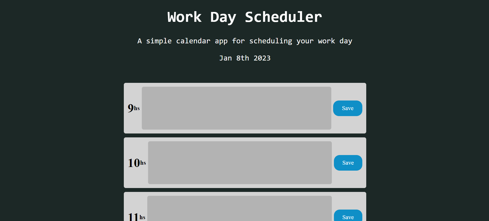

# WorkDay_Scheduler
# Description 
This is a simple calendar app which can be used to schedule a work day. Events can be typed and saved on the scheduler and viewed when the page is refreshed. The calender is colour coded, white blocks are past, red blocks are present and green blocks are future. The calendar app was created using j query and moment js with custom css styling. 
[Link to the deployed project](https://al946x.github.io/WorkDay_Scheduler/)

# Screenshot 

# Installation
Clone the repo from github and run it on your local machine

# Usage
N/A

# Credits
N/A

# License
N/A
